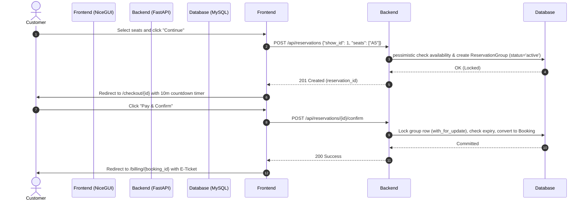

# Cinema Plus: Real-Time Seat Reservation & Concurrency Control Architecture

This document outlines the architectural design and concurrency controls implemented in Phase 3 to handle concurrent user seat bookings securely, prevent double-bookings, and manage the reservation session lifecycle.

---

## 1. Architectural Overview

The reservation system moves Cinema Plus from a direct booking model to a two-phase commit booking model:
1. **Selection & Temporary Lock**: Seats selected in the UI are held in a `ReservationGroup` session for 10 minutes.
2. **Payment & Confirmation**: During checkout, the reservation is confirmed and permanently converted to a `Booking` and `BookedSeat` rows.



---

## 2. Database Models & Schema

Two tables manage the temporary lock state:

### `reservation_groups`
Represents a customer's reservation session.
* `id` (INT, Primary Key, Indexed)
* `user_id` (INT, ForeignKey to `users.id`, Indexed)
* `show_id` (INT, ForeignKey to `shows.id`, Indexed)
* `reservation_token` (VARCHAR(100))
* `reserved_at` (DATETIME, Default UTC)
* `expires_at` (DATETIME, Indexed)
* `status` (VARCHAR(20), Indexed: `'active'`, `'expired'`, `'converted'`, `'cancelled'`)

### `seat_reservations`
Nested individual reserved seats.
* `id` (INT, Primary Key, Indexed)
* `reservation_group_id` (INT, ForeignKey to `reservation_groups.id`, Indexed)
* `seat_id` (VARCHAR(10), Indexed: e.g., `'A5'`)
* `show_id` (INT, ForeignKey to `shows.id`, Indexed)
* `status` (VARCHAR(20), Indexed: `'active'`, `'expired'`, `'converted'`, `'cancelled'`)

---

## 3. Concurrency Protection & Pessimistic Locking

To guarantee that two users cannot book the same seat under high concurrent access, we use database-level pessimistic locking via SQLAlchemy's `with_for_update()`:

1. When a user requests a checkout confirmation (`POST /api/reservations/{id}/confirm`), a transactional block starts.
2. The `ReservationGroup` row is locked using:
   ```python
   group = db.query(ReservationGroup).filter(ReservationGroup.id == group_id).with_for_update().first()
   ```
3. The server checks if the reservation is still valid (status is `'active'` and `expires_at > UTC NOW`).
4. If valid, the seats are converted to `BookedSeat` records, status is updated to `'converted'`, and the transaction is committed.
5. If another concurrent request was trying to acquire or checkout the same seats, it blocks or fails because the seats are already marked as taken or the lock on the reservation group prevents modifying the reservation state concurrently.

---

## 4. Reservation Lifecycle & Expiration

* **Expiration Timeout**: Configurable via `RESERVATION_TIMEOUT_MINUTES` (defaults to 10 minutes).
* **On-Demand Cleanup**: Every time seat availability is queried or a new reservation is requested, the service performs an on-demand cleanup:
  ```python
  expired_groups = db.query(ReservationGroup).filter(ReservationGroup.status == "active", ReservationGroup.expires_at <= now).all()
  ```
  It transitions them to `'expired'` and releases the seats back to the general pool.
* **Release/Cancellation**: Users can click "Release Seats" at checkout to immediately cancel the reservation group, freeing the seats for other buyers.

---

## 5. Event Dispatching & Audit Logging

An in-process event dispatcher manages seat reservation lifecycles and links them directly to the DB audit log:
* **Events**: `ReservationCreated`, `ReservationCancelled`, `ReservationExpired`, `ReservationConfirmed`, `BookingCreated`.
* **Auditing**: Event handlers automatically insert descriptive JSON-structured logs in `audit_logs` tracking changes to seat locking states.

---

## 6. NiceGUI Frontend Integration

1. **Seat Map Polling**: The seat selection page polls the backend every 5 seconds using `ui.timer` to refresh availability. Gaps or newly locked seats from other users appear dynamically as "Reserved" (amber/orange) or "Booked" (dark grey).
2. **Checkout Countdown**: The checkout screen renders a ticking countdown timer (MM:SS) showing exactly how much time is left. If the timer hits zero, the checkout button is disabled and the user is redirected.
3. **Admin Occupancy View**: Under "Manage Schedule", admins see live statistics (occupancy %, reservation %, conversion rate) per show and can open a read-only live seating layout grid dialog visualizing occupancy in real-time.
