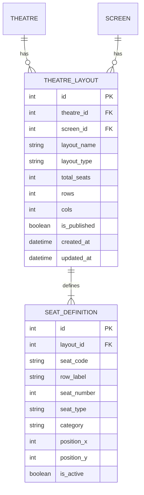
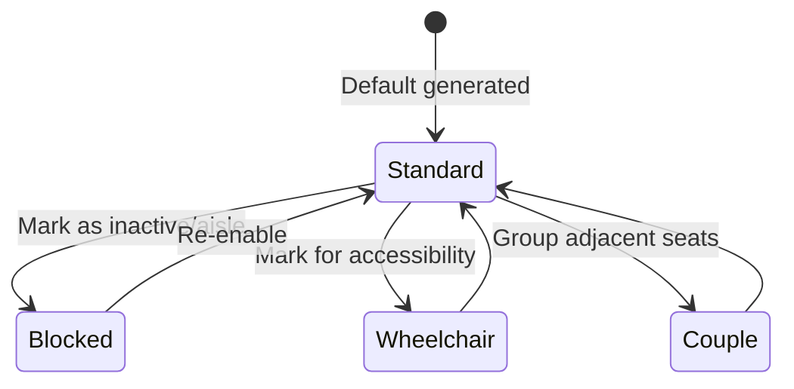

# Theatre Seating Layout & Live Designer Architecture

This document details the system design, domain models, generator engine, API specifications, and frontend integration for the Theatre Layout Management System in Cinema Plus.

---

## 1. Seating Layout Domain Model

The domain model consists of two primary normalized tables: `TheatreLayout` (the parent metadata container) and `SeatDefinition` (the individual seats linked to the layout).



### Constraints:
* **Unique Seat Code**: The combination of `(layout_id, seat_code)` must be unique.
* **Unique Grid Cell**: The combination of `(layout_id, position_x, position_y)` must be unique to prevent visual seat overlaps.

---

## 2. Layout Generator Engine

The generator engine (`backend/utils/layout_generator.py`) is a pure-logic module that calculates seating grid layouts given a target capacity, template name, and optional custom parameters.

### Template Configurations

| Template | Default Columns | Max Columns | Aisles | Wheelchair Auto-placement | Description |
|---|---|---|---|---|---|
| `STANDARD` | 20 | 24 | Center (width: 2) | Yes (last row outer) | Standard multiplex design |
| `IMAX` | 26 | 30 | Center + 2 Side | Yes (last row outer) | Wide theatre layout |
| `VIP` | 12 | 14 | Center (width: 2) | Yes | Spacious VIP leather seats |
| `RECLINER` | 8 | 10 | Center (width: 2) | Yes | Luxury reclining rows |
| `CUSTOM` | 20 | 30 | Center | No | Fully customizable sizing |

### Seat Numbering and Grid Positioning Algorithm
1. **Grid Sizing**: Based on target seats and template column parameters, the engine determines visual columns (`cols`) and rows (`rows`).
2. **Aisle Column Gaps**: Visual columns corresponding to aisles are left blank, shifting seats outward.
3. **Sequential Labeling**: Rows are labeled A-Z (AA, AB if exceeding 26).
4. **Centering Partial Rows**: If the final row has fewer seats than column capacity, they are visually centered within the grid.

---

## 3. Pricing Zone Assignment Logic

Pricing zones are designated by distance from the screen:

```
                  [ SCREEN ]
       
    Row 0 to N/4       ───►  Normal Category      (Red)
    N/4 to 3N/4        ───►  Executive Category   (Blue)
    3N/4 to Last Row   ───►  Premium Category     (Gold)
```

> [!IMPORTANT]
> **Pricing Zone Order**: Standard Cinema Plus seating positions the cheapest seats (`Normal`) closest to the screen and the most expensive seats (`Premium`) farthest from the screen.

---

## 4. Seat State Machine

Each seat definition in the layout belongs to one of the following types:



* **Standard**: Regular cinema seat.
* **Blocked**: Marked as "blocked" (visual slot is skipped or rendered inactive/empty in checkout).
* **Wheelchair**: Positioned at the outer edges of the rows, bookable but designated for accessibility.
* **Couple**: Double-wide visual representation or badged seat for two persons.

---

## 5. API Reference

### Layout Management Router (`/api/layouts`)

| Method | Endpoint | Auth | Request Body | Description |
|---|---|---|---|---|
| `POST` | `/generate` | Admin | `LayoutGenerateRequest` | Preview a generated layout (unsaved) |
| `POST` | `/save` | Admin | `LayoutSaveRequest` | Persist a draft layout |
| `GET` | `/screen/{screen_id}` | Public | None | Get published layout for a screen |
| `GET` | `/screen/{screen_id}/all` | Admin | None | List all layouts (draft + published) |
| `GET` | `/{layout_id}` | Admin | None | Get layout by ID |
| `PUT` | `/{layout_id}/publish` | Admin | None | Publish layout (deactivates previous) |
| `PUT` | `/{layout_id}/seats` | Admin | `LayoutBulkSeatUpdate` | Overwrite layout seat configurations |
| `GET` | `/{layout_id}/stats` | Admin | None | Calculate live layout statistics |
| `GET` | `/templates/list` | Admin | None | Get configurations of templates |
| `DELETE` | `/{layout_id}` | Admin | None | Remove a draft layout |

---

## 6. Reservation Integration Architecture

During booking and seat selection:
1. **Layout Fetching**: The `seat_selection` page checks for a published `TheatreLayout` for the selected `Show.screen_id`.
2. **Fallback Flow**: If no layout is defined, the UI falls back to the legacy algorithmic seating grid.
3. **Category Matching**: The checkout flow checks the exact `SeatDefinition.category` to determine prices, preventing mismatch between selection and checkout.
