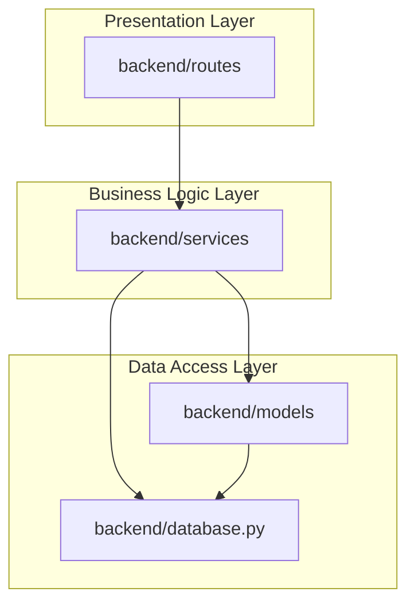

# Architecture Validation Report

*Timestamp:* 2026-06-27T12:11:00.924Z
*Method:* Directed Import Graph Cycle Search & Layer Constraints Checker

## Integrity Checklist
* **Backend Import Cycles (Circular Dependencies):** 0 cycles detected
* **Frontend Import Cycles:** 0 cycles detected
* **Architecture Layer Violations:** 0 issues flagged

## Layer Isolation Auditing
*No layer boundary violations found! Solid architectural partitioning verified.*

## Circular Dependency Audits
*No circular imports or import loops detected. Clean dependency graph! Only direct, acyclic dependency hierarchies found.*

## Conceptual Component Dependencies Map (Mermaid)

